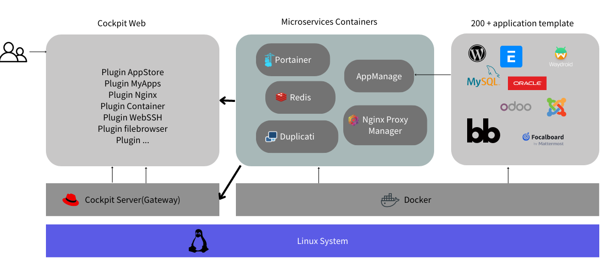

## Architecture

Websoft9 is very simple [architecture](https://www.canva.cn/design/DAFpI9loqzQ/hI_2vrtfoK7zJwauhJzipQ/view?utm_content=DAFpI9loqzQ&utm_campaign=designshare&utm_medium=link&utm_source=publishsharelink) which used [Redhat Cockpit ](https://cockpit-project.org/) for web framework and [Docker](https://www.docker.com/) for running [application](https://github.com/Websoft9/docker-library).  

The benefits of this architecture means you don't have to learn new technology stacks or worry about the lack of maintenance this project.

What we do is integrating below stacks's API or interfaces to Cockpit console by [Cockpit packages (Also known as plugin)](https://cockpit-project.org/guide/latest/packages.html) :  

- [Nginx Proxy Manager](https://nginxproxymanager.com/): A web-based Nginx management
- [Portainer](https://www.portainer.io/): Powerful container management for DevSecOps
- [Duplicati](https://www.duplicati.com/): Backup software to store encrypted backups online
- [Redis](https://redis.io/): The open source, in-memory data store
- [Appmanage](https://github.com/Websoft9/websoft9/tree/main/appmanage): API for create and manage docker compose based application powered by Websoft9
- [websoft9-plugins](https://github.com/websoft9?q=plugin&type=all&language=&sort=): Cockpit packages powered by Websoft9

As Websoft9 is a complete product, we also offer:

* API
* CLI

And Websoft9 is more attractive to users is [200+ application templates](https://github.com/Websoft9/docker-library). 